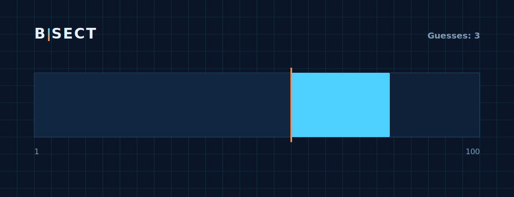

# Bisect

**▶ Live demo — [apps.charliekrug.com/bisect](https://apps.charliekrug.com/bisect/)**

[](https://github.com/ctkrug/bisect/actions/workflows/ci.yml)
[](LICENSE)

A binary search game you play by eye. Bisect is a number-guessing game with **zero text hints**:
every guess splits a bar and dims the losing half, so you learn binary-search intuition by
watching the surviving sliver shrink instead of reading "too high" or "too low."



## Who it's for

Programmers and CS students who know binary search as an algorithm but have never *felt* it as a
physical narrowing of space. The whole feedback loop is visual, with no language or reading
dependency, so it also works as a quiet puzzle for anyone who likes a tight minimal mechanic.

## The idea

Most guessing games narrate the search in words, so the algorithm stays abstract and no intuition
sticks. Bisect replaces every hint with a spatial transformation. The range you are searching is a
literal bar on screen, and each guess is a cut through it: the half that cannot hold the target
dims and locks out, and the surviving half redraws to fill the freed space. By your fourth guess
you are not parsing text, you are watching a search space collapse, which is exactly what binary
search is.

## Features

- **Pure visual feedback.** No "higher or lower" text, ever. The bar and its dimming are the hint.
- **Three levels, three real edge cases.** A clean range, a rotated range, and a range with
  duplicates. Each encodes a binary-search interview variant, and progress persists in
  `localStorage` behind a level-select screen that never blocks your first guess.
- **Guess-efficiency tracking.** The win overlay shows guesses taken next to the
  information-theoretic optimum, ⌈log₂ N⌉, so you can see how close to perfect you played.
- **Juice.** Tweened splits, an impact flash and shake on every guess, synthesized WebAudio SFX
  (tick, narrow, success, error, no audio files) with a persisted mute toggle, and a win
  celebration with a tick-mark burst.
- **Click or type.** Type a value or tap a position on the bar directly. Tapping is the only way
  to break a tie once Level 3 narrows to a run of identical values.

## Play

Guess a number from 1 to 100. Watch which half of the bar keeps its color, then guess again in the
surviving range. Solve a level to advance. That is the entire loop, and it is the whole point:
the loop *is* binary search.

## Stack

- TypeScript and HTML5 Canvas, bundled with [Vite](https://vitejs.dev/).
- No UI framework and no runtime dependencies. The game loop and rendering are hand-rolled.
- [Vitest](https://vitest.dev/) for unit tests on the game logic (100% line, branch, and function
  coverage on every logic module).
- Static output, no server required, deployable to any static host or subpath.

## Develop

```sh
npm install
npm run dev            # local dev server
npm test               # run the unit tests
npm run test:coverage  # tests with a v8 coverage report
npm run typecheck      # tsc -b --noEmit
npm run build          # production build to dist/
```

## Docs

- [`docs/VISION.md`](docs/VISION.md): why the game exists and what "v1 done" means.
- [`docs/DESIGN.md`](docs/DESIGN.md): the blueprint visual direction and design tokens.
- [`docs/ARCHITECTURE.md`](docs/ARCHITECTURE.md): module map, data flow, and the per-level domains.
- [`docs/BACKLOG.md`](docs/BACKLOG.md): the story list, all checked off for v1.

## License

MIT license. See [`LICENSE`](LICENSE).

---

More of Charlie's projects → [apps.charliekrug.com](https://apps.charliekrug.com)
